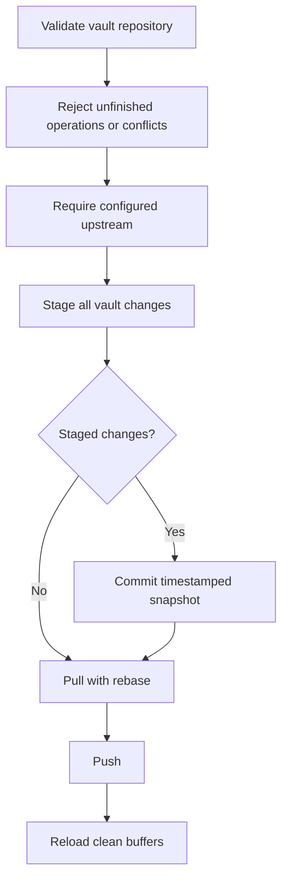

# Workflows

## Files, projects, and navigation

`mini.misc` automatically selects a project root by walking upward from the
current file to a root marker such as `.git` or `Makefile`.

The main navigation loop is:

1. Open a directory with `<Leader>ed` or the current file's directory with
   `<Leader>ef`.
2. Use `mini.files` for hierarchical navigation and filesystem changes.
3. Use `<Leader>ff` for files, `<Leader>fg` for contents, and `<Leader>fb` for
   open buffers.
4. Use visits and the `core` label for frequently revisited paths.

`mini.files` changes are edited as text and explicitly synchronized with `=`.

## Buffers and sessions

Use `<Leader>bd` for a single buffer and `<Leader>bo` when the current buffer is
the only working context that should remain visible.

The "delete others" action:

- keeps the current buffer;
- deletes other listed, unmodified buffers;
- preserves modified buffers;
- leaves unlisted utility buffers untouched;
- preserves the window layout through `mini.bufremove`.

Sessions are explicit rather than automatic. Create a named session with
`<Leader>sn`, save it with `<Leader>sw`, and restore it with `<Leader>sr`.
Persistent undo, ShaDa, visits, and sessions are complementary:

- undo files preserve editing history;
- ShaDa preserves editor history and registers;
- visits preserve path frequency and labels;
- sessions preserve a chosen editor layout and working set.

## Git

Git has three layers:

| Layer | Best use |
|---|---|
| `mini.diff` | In-buffer change signs, hunks, and overlays |
| `mini.git` | Repository commands, logs, diffs, and cursor-context information |
| LazyGit | Full interactive staging, history, branch, and remote workflows |

Use the narrowest layer that solves the task. Opening LazyGit for a simple hunk
inspection adds unnecessary context switching; using only editor primitives for
a branch rewrite is equally inefficient.

The custom LazyGit command:

- exists only when `lazygit` is executable;
- opens a centered floating terminal;
- uses the current working directory;
- enters terminal input mode;
- cleans up its window and buffer after exit.

## Language work

Tree-sitter provides structural parsing. Native LSP provides navigation,
diagnostics, completion, rename, and code actions. Mason installs the declared
servers. Conform owns explicit formatting.

The expected sequence for a source file is:

1. Tree-sitter starts for the filetype.
2. Native LSP resolves a project root and attaches the relevant server.
3. `mini.completion` consumes LSP completion with keyword fallback.
4. `mini.snippets` expands LSP or friendly-snippets entries.
5. `<Leader>lf` formats through Conform, with LSP fallback when needed.

Formatting is intentionally manual. Automatic formatting should not rewrite a
file merely because it was saved.

## Terminal and tmux

`<Leader>tt` opens a vertical terminal split and `<Leader>tT` a horizontal one.
Terminal buffers are unlisted and wiped when hidden so they do not pollute the
tabline, session, or buffer picker.

On Windows, the shell is selected in this order:

1. PowerShell 7 (`pwsh`)
2. Windows PowerShell (`powershell`)

Commands run non-interactively with UTF-8 input and output. On non-Windows
systems, tmux navigation is loaded only when running inside tmux; outside tmux,
the normal `mini.basics` split navigation remains active.

## Markdown editing

`after/ftplugin/markdown.lua` applies Markdown-only defaults:

- visual wrapping with `linebreak` and `breakindent`;
- no automatic hard line wrapping;
- two-space indentation;
- English (US) spell checking;
- markup concealment away from the cursor line;
- list-aware formatting without automatic comment insertion.

These settings are local to Markdown buffers and are reverted correctly if the
buffer's filetype changes.

Rendered Markdown is enabled for reading-oriented modes while Insert mode
exposes the source being edited. Pipe tables are padded and visually rounded.
Markdown table mode keeps the physical source aligned during and after editing.

## Markdown ownership

There are two deliberately separate Markdown contexts:

| Context | Owner |
|---|---|
| Normal Markdown repositories and workspaces | Markdown Oxide |
| Files under `~/vault/second-brain/` | obsidian.nvim |

Markdown Oxide's root resolver exits without attaching for vault files.
Obsidian therefore remains the single owner of vault links, notes, aliases, and
workspace-aware operations.

## Obsidian vault

The editor integration assumes:

```text
~/vault/second-brain/
├── notes/
├── inbox/
├── daily/
├── templates/
└── assets/
```

These are editor expectations, not a prescribed vault taxonomy. Vault content,
categories, and templates remain independent from the Neovim configuration.

### Note creation

`VaultNewNote` targets `notes/`; `VaultQuickNote` targets `inbox/`.

Both commands implement vault-wide open-or-create behavior:

1. Prompt for a human title.
2. Resolve notes across the complete active vault.
3. Keep only case-insensitive exact matches against the note's reference IDs,
   including title, alias, ID, and filename references.
4. Create a timestamped note only when no exact match exists.
5. Open the match directly when exactly one exists.
6. Ask the user to choose when several existing notes use the same reference.

This prevents duplicate notes caused by timestamped filenames without treating
fuzzy search results as exact identity matches. Daily notes retain a date-only
identifier so reopening the same day resolves to the same file.

## Vault synchronization

The custom sync module exists to make automated Git behavior conservative.

### Automatic synchronization

- A single sync is requested when first entering the vault, when enabled.
- Saving a vault file starts or resets a debounce timer.
- The default debounce window is 60 seconds.
- Automatic sync never writes a modified buffer.
- If a vault buffer remains modified, synchronization is deferred.
- Successful pulls reload only clean buffers through `checktime`.

### Manual synchronization

`:VaultSync` or `<Leader>nS`:

- saves modified vault buffers first;
- cancels the redundant automatic timer created by those saves;
- executes the same repository safety checks and Git sequence;
- reports successful completion.

### Git sequence



Before staging, the module verifies that:

- Git is available;
- the vault is the repository root, not a subdirectory of a larger repository;
- no merge, rebase, cherry-pick, or revert is unfinished;
- no unmerged files remain;
- the current branch has an upstream.

Git subprocesses disable interactive terminal prompts. Authentication must
already work through the platform's credential helper, SSH agent, or other
non-interactive Git configuration.

### Failure behavior

Any failed step suspends automatic synchronization. The error is shown once
with the failed Git step. After fixing the repository or authentication:

```vim
:VaultSync
```

A successful manual run clears the suspension and restores automatic sync.
Concurrent requests are coalesced; a manual request queued behind another sync
retains its manual semantics.

The module is intentionally not a conflict resolver. Resolve or abort Git
operations manually, then restart synchronization.
